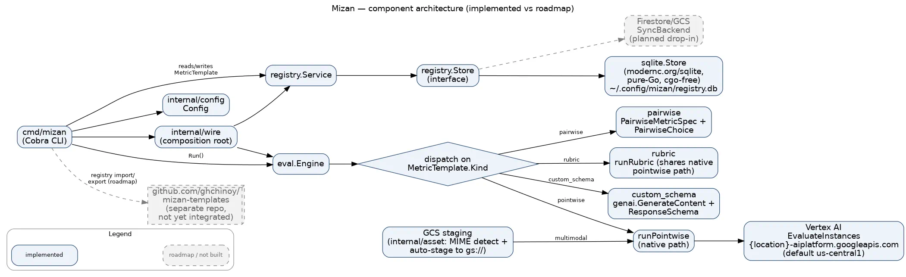

# Mizan

Mizan is a Go tool over the **Vertex AI Gen AI Evaluation Service** to create,
manage, share, and run Gemini "LLM-as-a-Judge" metric templates across all
modalities (text, image, audio, video, music). It is designed around one shared Go
core with two thin frontends: a Cobra CLI (the primary deliverable) and a later
Wails v2 desktop app.

## Contents

- [Status](#status)
- [Quickstart](#quickstart)
- [Local development](#local-development)
- [Releases](#releases)
- [Contributing](#contributing)
- [Architecture](#architecture)
- [Documentation](#documentation)
- [License](#license)
- [Disclaimer](#disclaimer)

## Status

**Mizan is installable today as a working CLI**: the metric registry, config,
and all four metric kinds (pointwise, rubric, custom_schema, pairwise) —
including multimodal assets — are shipped and verified against real Vertex AI.
The sections below are honest about the boundary between what runs now and
what isn't built — Mizan never claims a capability it hasn't actually shipped.

### Works today

- **Metric registry CRUD** — `mizan registry create|list|get|update|delete`,
  backed by a local, pure-Go SQLite store (no C toolchain required).
- **Config** — `mizan config show|set`, persisted to
  `<UserConfigDir>/mizan/.env`, with environment-variable overrides.
- **Pointwise evaluation** — `mizan eval run` calls the real Vertex AI
  `EvaluateInstances` API (region `us-central1` by default) and returns a live
  `Score` + `Explanation` for a `pointwise` metric template.
- **Rubric evaluation** — `registry create --kind rubric --rubric-group
  "name=criterion one;criterion two"` (or `--rubric-groups-file`) authors the
  rubric criteria; `eval run` returns a live `Score` + `Explanation`.
- **Custom-schema evaluation** — `registry create --kind custom_schema
  --response-schema '<json>'` (or `--response-schema-file`) authors the
  response schema; `eval run` returns live structured `CustomOutput` fields
  via the `genai.GenerateContent` path.
- **Pairwise evaluation** — `mizan eval pairwise --metric <id> --baseline
  key=value --candidate key=value` returns a live `Choice`
  (`BASELINE`/`CANDIDATE`/`TIE`) + `Explanation`.
- **Multimodal evaluation** (image/audio/video/music) — `eval run`/`eval
  pairwise` accept `--file key=/path` (auto-staged to your configured GCS
  staging bucket) or `--gcs key=gs://...` (pre-staged) for non-text fields.
- **Template packs & sharing** — `mizan pack init|add|validate` scaffolds and
  validates a metric-template pack (the `validate` step is a credential-free PR
  gate), and `mizan registry import|export` moves templates between the local
  registry and a pack tree or git repo (default
  `github.com/ghchinoy/mizan-templates`). Share a pack by committing it and
  opening a PR — Mizan never pushes on your behalf.

See the [user guide](docs/user-guide.md) and
[testing guide](docs/testing-guide.md) for full walkthroughs with real,
live-verified command output.

### Not built yet

Batch evaluation and the desktop app are **not built** — do not expect them to
work. For what is planned but not yet built, see
[`docs/roadmap.md`](docs/roadmap.md).

## Quickstart

Prerequisites:

- Go 1.26+ (only needed if building from source — `go install` fetches its own
  toolchain requirement automatically).
- A GCP project with the Vertex AI API enabled.
- Application Default Credentials available, e.g.:

  ```sh
  gcloud auth application-default login
  ```

Install (cgo-free — no C compiler needed, thanks to the pure-Go
`modernc.org/sqlite` driver):

```sh
go install github.com/ghchinoy/mizan/cmd/mizan@v0.1.0
```

Point Mizan at your project:

```sh
mizan config set project-id <your-project-id>
mizan config show
```

Create a text pointwise metric and run it:

```sh
mizan registry create --id demo/conciseness --name "Conciseness" \
    --description "Scores how concise a response is" \
    --kind pointwise \
    --prompt "Rate how concise this response is from 0 (verbose) to 1 (concise). Response: {{response}}" \
    --model gemini-2.5-flash

mizan eval run --metric demo/conciseness --field response="The cat sat on the mat."
```

Example output (verified live against Vertex AI):

```
Score:        1
Explanation:  The response 'The cat sat on the mat.' is a very short, direct, and grammatically complete sentence that conveys its meaning with no superfluous words, making it maximally concise.
```

For the full walkthrough (registry lifecycle, interpreting results,
troubleshooting), see the [user guide](docs/user-guide.md).

## Local development

Building from source needs Go 1.26+ (the `toolchain` directive in `go.mod`
pins the exact version and `go` fetches it automatically). No C compiler is
required — the SQLite driver is pure Go.

```sh
git clone https://github.com/ghchinoy/mizan.git
cd mizan
make build          # builds ./bin/mizan (CGO_ENABLED=0)
make test           # unit tests: go test ./...
```

Run `make help` for the full target list (`vet`, `fmt`, `install`, `cover`).
The integration tests hit real Vertex AI, so they need credentials and a
project:

```sh
export MIZAN_PROJECT_ID=<your-project-id>
make integration-test   # go test -tags integration ./...
```

## Releases

Releases are cut as semantic-version git tags (e.g. `v0.1.0`). Pin an install
to a specific release by using the tag in the module path:

```sh
go install github.com/ghchinoy/mizan/cmd/mizan@v0.1.0
```

## Contributing

Contributions are welcome. See [CONTRIBUTING.md](CONTRIBUTING.md) for local
setup, the CI gates your change must pass, and branch/PR conventions. In short:
for anything beyond a small fix, consider opening an issue first to discuss the
change, and before opening a PR run `make fmt-check`, `make vet`, and `make test`
(plus `make lint` and `make vuln`) and keep them green. To share metric
templates, author a pack with `mizan pack` and open a PR against
[`github.com/ghchinoy/mizan-templates`](https://github.com/ghchinoy/mizan-templates) —
Mizan does not push on your behalf.

## Architecture

`cmd/mizan` composes `registry.Service`, `eval.Engine`, and `config` through a
single `internal/wire` composition root; it never imports the SQLite driver,
sync/codec layers, or the Vertex AI proto types directly. See
[`docs/architecture-final.md`](docs/architecture-final.md) for the full design,
including this component diagram distinguishing implemented paths from planned
ones (see [`docs/roadmap.md`](docs/roadmap.md)):



## Documentation

- Start with the docs index: [`docs/README.md`](docs/README.md).
- New to the CLI? Read the [user guide](docs/user-guide.md).
- Current architecture (single source of truth):
  [`docs/architecture-final.md`](docs/architecture-final.md).
- Planned capabilities that are **not built yet**:
  [`docs/roadmap.md`](docs/roadmap.md).

## License

Mizan is licensed under the Apache License 2.0. See [`LICENSE`](LICENSE) for the
full text and [`NOTICE`](NOTICE) for attribution.

## Disclaimer

This project is not an official Google project. It is not supported by Google and Google specifically disclaims all warranties as to its quality, merchantability, or fitness for a particular purpose.
