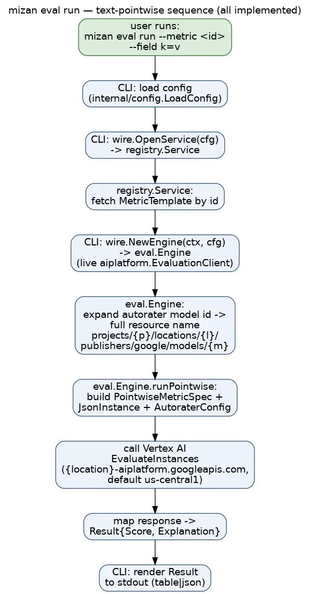

# Mizan User Guide

This guide covers what Mizan can actually do today: manage a local metric
registry, configure credentials/project settings, and run evaluations —
single (pointwise), compare (pairwise), rubric, and custom_schema, including
multimodal (image/audio/video/music) assets — against the live Vertex AI Gen AI
Evaluation Service. All four metric kinds and multimodal are implemented and
CLI-runnable end-to-end. Every command and output shown below was run against
the built CLI; where a capability isn't implemented yet, this guide says so
explicitly rather than implying it works. For deeper, copy-pasteable recipes
for every metric kind (including live error output for the compare/pairwise
placeholder contract and the create-time rubric/schema validation), see
[`docs/testing-guide.md`](testing-guide.md).

For the underlying design, see [`architecture-final.md`](architecture-final.md).
For capabilities that are planned but not built, see
[`roadmap.md`](roadmap.md).

## Prerequisites

- **Go 1.26+** — only required if you're building from source. `go install`
  (below) handles the toolchain for you.
- **A GCP project with the Vertex AI API enabled.**
- **Application Default Credentials (ADC)** configured, e.g.:

  ```sh
  gcloud auth application-default login
  ```

  (or a service account / workload identity if running in a deployed
  context — there is no API-key auth path.)
- **IAM permission to call Vertex AI** — the `Vertex AI User` role (or
  equivalent) on the project you configure.

## Install

```sh
go install github.com/ghchinoy/mizan/cmd/mizan@main
```

Mizan uses the pure-Go `modernc.org/sqlite` driver for its local registry
store, so this install is **cgo-free** — no C toolchain required, even though
the registry is backed by SQLite.

## Configure

Set your project:

```sh
mizan config set project-id <your-project-id>
```

Optionally set the region (default is `us-central1`):

```sh
mizan config set location us-central1
```

> The multi-region value `us` is **not** valid for the native eval path and
> will 404 — always use a concrete region such as `us-central1`.

Check the resolved configuration (`mizan config list` is an alias for
`mizan config show`):

```sh
$ mizan config show
KEY             VALUE                                 SOURCE
project-id      my-project                            env-file
location        us-central1                           default
staging-bucket  (unset)                               default
api-endpoint    (unset)                               default
registry-db     /home/you/.config/mizan/registry.db   default
pack-cache      /home/you/.cache/mizan/packs          default
templates-repo  github.com/ghchinoy/mizan-templates   default
default-model   gemini-2.5-flash (built-in)           default
```

Each row is labelled by the **exact `config set` key**, so what `config show`
prints round-trips directly into `config set <key> <value>` — no need to consult
`config set --help` to discover the key names. The `SOURCE` column shows where
each value came from:

| Source | Meaning |
|---|---|
| `env` | an exported environment variable (wins over everything) |
| `env-file` | the persisted `<UserConfigDir>/mizan/.env` |
| `default` | the built-in default (or unset, for values with none) |

`config show` works fine with no project ID set (it prints `(unset)`) — only
`eval run` hard-requires a project ID. `registry` and `config` commands work
without one.

`mizan config set` persists values to `<UserConfigDir>/mizan/.env` (e.g.
`~/.config/mizan/.env` on Linux), created with restrictive permissions
(`chmod 0600` on the file, `0700` on the directory). Valid keys: `api-endpoint`,
`default-model`, `location`, `pack-cache`, `project-id`, `registry-db`,
`staging-bucket`, `templates-repo`.

You can also configure via environment variables instead of (or in addition
to) the persisted file — real environment variables always win over the
`.env` file:

| Config value | Env var(s) |
|---|---|
| Project ID | `MIZAN_PROJECT_ID` or `PROJECT_ID` |
| Location | `MIZAN_LOCATION` |
| Staging bucket | `MIZAN_STAGING_BUCKET` |
| API endpoint | `MIZAN_API_ENDPOINT` |
| Registry DB path | `MIZAN_REGISTRY_DB` |
| Pack cache dir | `MIZAN_PACK_CACHE` |
| Templates repo | `MIZAN_TEMPLATES_REPO` |
| Default model | `MIZAN_DEFAULT_MODEL` |

You can also point Mizan at an explicit env file with `MIZAN_ENV_FILE`.

**Unknown-variable warning:** if you export a `MIZAN_*` variable Mizan does not
recognize — for example the easy-to-mistype `MIZAN_PROJECT` instead of
`MIZAN_PROJECT_ID` — Mizan prints a warning to stderr and *ignores* the value
rather than silently dropping it:

```
mizan: warning: ignoring unknown env var MIZAN_PROJECT (did you mean MIZAN_PROJECT_ID?)
```

Combined with the `SOURCE` column in `config show` (and the `src=` hints in the
`eval` pre-flight line), this makes it obvious when a value came from a place you
did not expect. Note that a mistyped variable is *ignored*, not applied — use the
exact name from the table above.

**Per-invocation `--project` flag:** `mizan eval` accepts a `--project` flag that
overrides the GCP project for a single run, without touching your persisted `.env`
or exported environment. It is available on both `eval run` and `eval pairwise`:

```sh
mizan eval run --project other-project --metric demo/conciseness --field response="…"
mizan eval pairwise --project other-project --metric demo/pref --baseline a=… --candidate b=…
```

The flag sits at the **top** of the project precedence chain:

```
--project flag  >  exported MIZAN_PROJECT_ID / PROJECT_ID  >  .env file  >  (default: unset → error)
```

When you pass `--project`, the pre-flight echo attributes the project to the flag
so it is obvious the override took effect:

```
mizan: autorater → project=other-project (src=flag) location=us-central1 (src=default) model=gemini-2.5-flash (path=native)
```

Omitting `--project` leaves the environment/`.env` precedence above completely
unchanged. (Exporting `MIZAN_PROJECT_ID=other-project mizan eval run …` for one
command still works too — the flag is simply a clearer, per-command equivalent.)

The `--project` value is validated locally against the GCP project-id format
(6–30 characters, a lowercase letter first, then lowercase letters, digits or
`-`, no trailing `-`), so a typo fails fast with a crisp error instead of an
opaque server-side `InvalidArgument`.

**Security note:** Mizan refuses a custom `--api-endpoint` / `MIZAN_API_ENDPOINT`
whose host isn't `*.googleapis.com`, because the Vertex client attaches your
ADC bearer token to every request — an arbitrary endpoint could exfiltrate it.
If you genuinely need a non-Google endpoint (e.g. a test proxy), set
`MIZAN_ALLOW_CUSTOM_ENDPOINT=1` to override.

## Registry walkthrough

The registry holds your metric templates locally (SQLite file at
`RegistryDBPath`). Every template has a stable id of the form
`<namespace>/<slug>` (e.g. `demo/conciseness`) — you choose both parts.

### Create

```sh
$ mizan registry create --id demo/conciseness --name "Conciseness" \
    --description "Scores how concise a response is" \
    --kind pointwise \
    --prompt "Rate how concise this response is from 0 (verbose) to 1 (concise). Response: {{response}}" \
    --model gemini-2.5-flash
ID:             demo/conciseness
Name:           Conciseness
Kind:           pointwise
Modalities:     text
Model:          gemini-2.5-flash
SamplingCount:  4
Description:    Scores how concise a response is
Prompt:         Rate how concise this response is from 0 (verbose) to 1 (concise). Response: {{response}}
```

Prompt templates use double-brace `{{var}}` placeholders. The check runs in
**both directions** before any API call, so a mis-authored template or a stray
`--field` fails fast with a clear error instead of silently producing a wrong
score:

- Every placeholder in the prompt must be supplied as a `--field` when you run
  the metric (see below) — a missing value fails the run.
- Conversely, every `--field` you supply must match a placeholder. A `--field`
  whose key matches no `{{placeholder}}` (for example a typo, or an extra key)
  is rejected — otherwise its value would be silently dropped and never reach
  the judge. Likewise, running a template that contains **no** `{{placeholder}}`
  at all while supplying `--field` values is an error: the values cannot reach
  the judge, so Mizan tells you to add a `{{...}}` placeholder (single-brace
  `{var}` is **not** recognized — use `{{var}}`).

`--kind` accepts `single` (or `pointwise`), `compare` (or `pairwise`),
`rubric`, or `custom_schema`, and all four are runnable end-to-end today.

> **single = pointwise, compare = pairwise.** *Pointwise* and *pairwise* are
> the Vertex AI Gen AI Evaluation Service's own terms — non-standard jargon —
> so Mizan also accepts the plainer spellings wherever the Vertex ones work:
> as `--kind` values (`single|pointwise`, `compare|pairwise`), and as the
> subcommands `mizan eval single` (= `mizan eval run`, score **one**
> response) and `mizan eval compare` (= `mizan eval pairwise`, compare
> **two** responses). `rubric` and `custom_schema` are the other two kinds;
> both are run through `mizan eval run`. Whichever spelling you pass, the CLI
> folds it to the canonical kind, so a stored template always reports
> `pointwise` / `pairwise`.

Two kinds need extra authoring flags, and one has an extra structural
requirement on its prompt:

- **`single` (`pointwise`)** — no extra flags needed beyond `--prompt`; see
  [Scoring a single text response](#scoring-a-single-text-response-end-to-end)
  below.
- **`rubric`** — also requires `--rubric-group "name=criterion
  one;criterion two"` (repeatable) or `--rubric-groups-file <path>`; `create`
  rejects the template immediately if neither is given.
- **`custom_schema`** — also requires `--response-schema '<json>'` or
  `--response-schema-file <path>`; `create` rejects the template immediately
  if neither is given.
- **`compare` (`pairwise`)** — also requires
  `--baseline-field`/`--candidate-field`, and the `--prompt` text must
  reference those field names as `{{name}}` placeholders (the run fails
  otherwise, since the API rejects instance keys the template doesn't
  reference). Use the dedicated `mizan eval compare` / `mizan eval pairwise
  --baseline key=value --candidate key=value` command, which makes the
  baseline/candidate roles explicit (generic `eval run --field` also
  technically works, since the compare fields are ordinary placeholders, but
  the dedicated command is the documented, less error-prone path).

See [`docs/testing-guide.md`](testing-guide.md) for full recipes and live
output for every kind.

Other useful create flags: `--system` (system instruction), `--sampling-count`
(autorater sampling count, default 4 — lowering it trades self-consistency for
latency), `--modality` (repeatable; default `text`), `--tag` (repeatable),
`--flip-enabled` (pairwise position-bias mitigation, default `true`; see the
compare/pairwise flip note below).

### List

```sh
$ mizan registry list
ID                NAME         KIND       MODEL
demo/conciseness  Conciseness  pointwise  gemini-2.5-flash
```

Filter with `--namespace <prefix>` or `--kind <kind>`.

### Get

```sh
$ mizan registry get demo/conciseness
ID:             demo/conciseness
Name:           Conciseness
Kind:           pointwise
Modalities:     text
Model:          gemini-2.5-flash
SamplingCount:  4
Description:    Scores how concise a response is
Prompt:         Rate how concise this response is from 0 (verbose) to 1 (concise). Response: {{response}}
```

### Update

Only the flags you pass are changed; everything else is left as-is:

```sh
$ mizan registry update demo/conciseness --description "Updated description"
```

(Verified: updating just `--description` leaves the prompt, model, and every
other field untouched.)

### Delete

```sh
$ mizan registry delete demo/conciseness
deleted demo/conciseness
```

### Import (from a local pack tree)

Metric templates can be shared as git-backed YAML **packs**. To pull templates
from a **local checkout** of a packs repository (e.g.
`github.com/ghchinoy/mizan-templates`) into your local registry, point
`registry import` at the checkout — a directory containing a `packs/` tree — or
at a single pack directory:

```sh
$ mizan registry import ./mizan-templates
1 inserted, 0 updated, 0 skipped, 0 conflicted, 0 unchanged, 0 forked (source: ./mizan-templates)
  inserted: google-brand/video-brand-alignment
```

The imported template is now a normal registry entry — list it, get it, and run
it like any local template. `registry get` shows its provenance in the `Source`
field:

```sh
$ mizan registry get google-brand/video-brand-alignment
ID:             google-brand/video-brand-alignment
Name:           Video Brand Alignment
Kind:           pointwise
Modalities:     video,text
Model:          gemini-2.5-pro
SamplingCount:  4
Source:         pack:google-brand@./mizan-templates
Description:    Scores whether a short video ad aligns with a supplied brand guideline, ...
```

#### Reconciling existing templates (`--strategy`)

When an incoming template's id already exists locally, `registry import`
reconciles the two by comparing their `metadata.version` (semver) and content.
The `--strategy` flag chooses the policy (default **`newer`**):

| `--strategy`        | absent | same content | upstream newer | upstream older | same version, changed content | your local edit (dirty) |
|---------------------|--------|--------------|----------------|----------------|-------------------------------|-------------------------|
| `newer` *(default)* | insert | no-op        | update         | skip           | **conflict** (skip + report)  | **skip** (protected)    |
| `skip`              | insert | no-op        | skip           | skip           | skip                          | skip                    |
| `overwrite`         | insert | no-op        | update         | update         | update                        | update                  |
| `fork`              | insert | no-op        | update         | skip           | fork → `<ns>-fork/<slug>`     | fork → `<ns>-fork/<slug>` |

Re-importing an unchanged pack is a **no-op** — nothing is written and each
template is reported as `unchanged`:

```sh
$ mizan registry import ./mizan-templates
0 inserted, 0 updated, 0 skipped, 0 conflicted, 1 unchanged, 0 forked (source: ./mizan-templates)
  unchanged: google-brand/video-brand-alignment (unchanged (same content))
```

**Dirty protection.** If you edit an imported template with `registry update`,
it is marked *dirty* (a local edit). Under the default `newer` strategy a dirty
template is **never overwritten** by a re-import — it is skipped with a warning
so your work is safe. Pull upstream anyway with `--strategy overwrite` (replace
your edit) or `--strategy fork` (keep your edit; import upstream under
`<ns>-fork/<slug>`).

**Equal version, changed content** is treated as a **conflict** under `newer`:
the upstream author changed the template without bumping the version, so Mizan
refuses to guess — it reports the conflict and leaves your copy untouched. Re-run
with an explicit `--strategy overwrite` or `--strategy fork` to resolve it.

**Preview with `--dry-run`.** Compute and print the full report **without writing
anything** to your registry:

```sh
$ mizan registry import ./mizan-templates --strategy overwrite --dry-run
dry run (no changes written): 0 inserted, 1 updated, 0 skipped, 0 conflicted, 0 unchanged, 0 forked (source: ./mizan-templates)
  updated: google-brand/video-brand-alignment (updated to newer upstream version)
```

#### Import directly from a git URL

`registry import` also takes a **git URL** — Mizan shells out to *your* `git` to
clone (or, on a repeat, fast-forward pull) the repository into a local **pack
cache** (`pack-cache`, default `<cache-dir>/mizan/packs`), then reads its
`packs/` tree and reconciles exactly as a local import does:

```sh
# Full URL, or the scheme-less github.com/<owner>/<repo> shorthand — both work.
$ mizan registry import https://github.com/ghchinoy/mizan-templates
$ mizan registry import github.com/ghchinoy/mizan-templates
```

The cache is laid out per remote at `<pack-cache>/<host>/<owner>/<repo>`, so
several source repos coexist and a re-import only pulls the delta.

#### Import from the default repo (bare `import`)

With **no argument**, `registry import` pulls from your configured default
templates repo (`templates-repo`, default
`github.com/ghchinoy/mizan-templates`):

```sh
$ mizan registry import                    # == import github.com/ghchinoy/mizan-templates
$ mizan registry import --namespace google-brand   # only packs under google-brand
```

Point it at a different canonical repo (a team repo, your fork) by setting the
default once — no other change is needed:

```sh
$ mizan config set templates-repo github.com/yourorg/your-templates
$ mizan registry import                    # now pulls from your repo
```

`--namespace <ns>` imports only the packs under one namespace and works with any
source (git URL, bare/default, or a local tree). All the reconciliation flags
above (`--strategy`, `--dry-run`) apply unchanged.

> **How Mizan runs git — and why it is safe.** Mizan invokes `git` with an
> explicit argument list (never a shell string), so a URL cannot inject a command.
> The URL is validated first (scheme allow-list `https`/`http`/`ssh`/`git`, a
> strict host, and no `..`/option-looking path segments), any credentials embedded
> in the URL are redacted from output and stored provenance, and the git process
> runs under a timeout. A cloned repo is treated as **untrusted content**: reads
> are confined to the checkout (symlinks that would escape the tree are skipped)
> and bounded in size.

### Validating a pack (`pack validate`)

Before you open a PR against a packs repo (or before you import an untrusted
pack), validate it. `mizan pack validate` runs a **credential-free** check over
every manifest under a path — a single pack directory, or a repo tree that
contains a `packs/` directory:

```sh
$ mizan pack validate ./mizan-templates
OK: no defects found.

0 error(s), 0 warning(s)
```

It validates two manifest kinds:

- **`kind: MetricTemplate`** — structural schema (strict: a misspelled key is an
  error), identity (`<namespace>/<slug>` id, semver `version`, unique-in-pack),
  kind-specific rules (pairwise needs `candidateFieldName`/`baselineFieldName`
  declared in `inputs`; `rubric` needs `rubricGroups`; `custom_schema` needs a
  valid `responseSchema`; `pointwise` forbids all three), placeholder
  consistency (every `{{x}}` is declared in `inputs`, every required input is
  referenced, each input's modality is listed in `spec.modalities`), and lint
  **warnings** (missing description/license/model, out-of-range
  `samplingCount`). Both the vernacular (`single`/`compare`) and canonical
  (`pointwise`/`pairwise`) `spec.kind` spellings are accepted.
- **`kind: EvalSet`** — a **format-only** manifest (see below) that names a group
  of metric ids for an asset class. It is validated for structure, a semver
  `version`, a non-empty `spec.members` list whose `metric` ids are
  syntactically valid, and a reserved `aggregation.method`. A member that
  references a template **not present in the validated tree** is a *warning*
  (it may live in another pack that isn't checked out).

The command **exits non-zero** if any **error** is found; lint **warnings never
fail** it. That makes it usable as a PR merge gate — the exact check the
`mizan-templates` repo's CI runs. A defective template reports every problem at
once:

```sh
$ mizan pack validate ./my-pack
templates/broken.yaml:
  [ERROR] spec.kind: unknown metric kind "poinwise" (want one of: single|pointwise, compare|pairwise, rubric, custom_schema)
  [ERROR] prompt references undeclared placeholder {{respones}} (add it to spec.inputs)
  [warn ] lint: missing metadata.license

1 error(s), 1 warning(s)
```

Pass `--dry-run` to add an opt-in, **credentialed** step after the checks pass:
one live materialize+call per template to confirm the autorater API accepts it.
Templates whose inputs include a non-text modality are skipped (a live probe
can't fabricate a real asset). Steps 1–5 always run without credentials;
`--dry-run` is the only part that needs a configured project.

> **EvalSet is format-only in P2.** A `kind: EvalSet` manifest is **carried and
> validated** but is **not** imported into your local registry or run — there is
> no eval-set runner yet. It exists so tools and future features have a stable,
> schema-governed, git-shareable way to name a group of metrics for an asset
> class. See `docs/collaboration-design.md` §3.4a.

### Export (local templates → a pack dir)

Sharing works the other way too: `registry export` writes templates from your
local registry into a **pack directory** — one YAML file per template under
`templates/` — which you then commit and open a PR against a packs repository.
Select what to export with **exactly one** of `--id`, `--namespace`, or `--all`:

```sh
$ mizan registry export --out packs/acme --all
2 written, 0 skipped (dest: packs/acme)
  written: acme/quality -> templates/quality.yaml
  written: acme/tone -> templates/tone.yaml
```

```sh
$ mizan registry export --out packs/acme --namespace acme     # one namespace
$ mizan registry export --out packs/acme --id acme/quality    # one template
```

The output filename is derived from the template's **slug** (the part of the id
after `<namespace>/`), so `acme/quality` becomes `templates/quality.yaml`.
`export` writes locally only — it never pushes; committing the pack dir and
opening the PR is your step.

### Authoring a pack (`pack init`, `pack add`)

`pack init` scaffolds an empty, valid pack directory: a `mizan-pack.yaml`
manifest (whose `metadata.name` is the namespace), an empty `templates/`
directory, and an empty `evalsets/` directory (the carriage hook for shareable
eval-sets). It emits **no** CI workflow — the pack-validation workflow lives once
in the `mizan-templates` repo, not in every scaffolded pack.

```sh
$ mizan pack init packs/acme --name acme
initialized pack "packs/acme" (namespace "acme")

$ ls packs/acme
evalsets/  mizan-pack.yaml  templates/
```

`pack add` is a thin convenience over `export` that writes **one** local
template into a pack dir as a schema-valid file:

```sh
$ mizan pack add packs/acme --from acme/quality
1 written, 0 skipped (dest: packs/acme)
  written: acme/quality -> templates/quality.yaml
```

### The export → PR → import round-trip (the collaborator loop)

This is the founding differentiator: a metric you author locally can be shared,
reviewed, and adopted by a collaborator **without loss** — the same fields come
back on the other side, and re-exporting produces byte-identical files.

```sh
# 1. Author or refine a metric locally.
$ mizan registry create --id acme/quality --name "Quality" \
    --kind pointwise --prompt 'Rate the response: {{response}}'

# 2. Scaffold a pack and export the metric into it.
$ mizan pack init packs/acme --name acme
$ mizan registry export --out packs/acme --namespace acme

# 3. Commit the pack dir and open a PR against your packs repo (your git step).
$ git add packs/acme && git commit -m "add acme quality metric" && git push

# 4. A collaborator (or you, elsewhere) imports the merged pack.
$ mizan registry import ./mizan-templates
1 inserted, 0 skipped (source: ./mizan-templates)
  inserted: acme/quality
```

Round-trips are stable by construction: the codec canonicalizes the pack file
(sorted keys, canonical `spec.kind`, computed fields omitted), so
`export → import → export` is byte-identical and a custom_schema template's
`contentHash` does not drift from JSON key ordering.

### Output format

Every registry (and config) command supports `-o/--output json|table`
(default `table`) for scripting.

## Scoring a single text response end-to-end

Create the metric (as above), then score one response with
`mizan eval single` — `mizan eval run` is the same command, and is the
spelling the transcript below was captured with:

```sh
$ mizan eval run --metric demo/conciseness --field response="The cat sat on the mat."
Score:        1
Explanation:  The response 'The cat sat on the mat.' is a very short, direct, and grammatically complete sentence that conveys its meaning with no superfluous words, making it maximally concise.
```

This is a **live call** to Vertex AI's `EvaluateInstances` API in the
configured region (`us-central1` by default). `--field key=value` is treated
as plain text; for image/audio/video/music assets, use `--file key=/path`
(local file, auto-staged to your configured GCS staging bucket) or `--gcs
key=gs://...` (a pre-staged asset) instead — see
[`docs/testing-guide.md`](testing-guide.md#multimodal) for a full multimodal
walkthrough.

### Choosing the judge model — and global-only judges

The autorater model is resolved per run: `--model` flag > template model >
`default-model` config (`MIZAN_DEFAULT_MODEL`) > built-in `gemini-2.5-flash`.

Some newer judges — the `gemini-3.5` family (`gemini-3.5-flash` /
`-flash-lite`) — are **global-only**: they exist only on Vertex's global eval
host and return `NOT_FOUND` on a regional endpoint. You do **not** need to change
`--location` to use one. When the resolved judge is global-only, Mizan
automatically runs the whole eval call against the global host
(`aiplatform.googleapis.com` / `locations/global`) — either up front for a known
global-only model, or by transparently retrying on the global host after the
regional call reports the autorater is not found.

Because a global-only judge cannot run in your region, this routing is **forced**:
your configured `--location` / `MIZAN_LOCATION` is kept for output labeling but
is not honored as a residency region for that run. Mizan says so on stderr, e.g.:

```
mizan: autorater gemini-3.5-flash is global-only (…); routing this eval to the GLOBAL host (location=global). Your configured --location is kept for labeling only.
```

The pre-flight echo Mizan prints to stderr before each call also shows
`location=global (src=global-route)` for a known global-only judge — the
`global-route` source makes clear the global location came from this forced
routing, not from a fully-qualified model resource (which would read `src=model`).
The built-in default (`gemini-2.5-flash`) is served on both
regional and global endpoints, so a default run is never re-routed. For the full
detection details see
[`docs/llm-as-judge-scenarios.md`](llm-as-judge-scenarios.md) Scenario 7.

### Interpreting the result

- **`Score`** is a float. Its range and meaning are whatever your prompt's
  rubric implies — Mizan does not impose a fixed scale (in the example above,
  the prompt asked for 0–1, so 1 means "very concise"). Read your own prompt
  template to know how to interpret the number it produces.
- **`Explanation`** is free-text rationale generated by the autorater model,
  not a fixed-format field — treat it as a qualitative aid, not something to
  parse programmatically.

## Per-criterion rubric detail (`--rubric-detail`)

For a `rubric` template, add `--rubric-detail` to `eval run` to get a score and
rationale for **each authored criterion** (plus an overall roll-up), instead of a
single score. Set the Likert scale with `--rubric-scale "<min>-<max>"` (default
`1-5`; non-negative, `min < max`). See
[`docs/llm-as-judge-scenarios.md`](llm-as-judge-scenarios.md) Scenario 4 for the
full walkthrough and output shape.

The judge's returned criteria are **strictly reconciled** against your authored
set, matched by the exact **(group, criterion)** pair:

- a **missing** authored criterion (authored but not returned by the judge) fails
  the run with an `eval:` error naming the missing pair(s) — a partial scorecard
  is never surfaced;
- a **duplicated** authored criterion (the same pair returned more than once)
  fails the run with an `eval:` error naming the duplicated pair(s);
- an **extra** criterion (returned but not authored) is **kept in the output** and
  a warning is printed to **stderr** — extras are informative, not corrupting, so
  they do not fail the run.

## Version and releases

Check which build you're running:

```sh
$ mizan version
mizan v1.2.3 (commit a1b2c3d, built 2026-08-10T00:00:00Z)
```

Like every other command, `version` honors `-o/--output json|table` (default a
plain line) for scripting:

```sh
$ mizan version -o json
{
  "version": "v1.2.3",
  "commit": "a1b2c3d",
  "date": "2026-08-10T00:00:00Z"
}
```

The three values are injected at build time via `-ldflags`. A plain
`go build ./cmd/mizan` (no ldflags) reports the placeholders
`dev`/`none`/`unknown`; `make build` and `make install` populate them from
`git describe --tags --always --dirty`, the short commit, and a UTC timestamp.

### Cutting a release

Releases are tag-driven. Push a `vX.Y.Z` tag and the
[`release` workflow](../.github/workflows/release.yml) cross-compiles CGO-free
binaries (linux/darwin × amd64/arm64), stamps them with the tag via the same
ldflags, and attaches the tarballs plus `.sha256` sums to the GitHub Release:

```sh
git tag v1.2.3
git push origin v1.2.3
```

Once a `vX.Y.Z` tag exists, downstreams (e.g. the `mizan-templates`
`validate-packs` CI) can pin `MIZAN_VERSION=vX.Y.Z` instead of tracking
`@main`.

## Troubleshooting

**`Error: config: project ID not set (set MIZAN_PROJECT_ID or PROJECT_ID)`**
`eval run` requires a project id. Run `mizan config set project-id <id>` or
export `MIZAN_PROJECT_ID`/`PROJECT_ID`. (Registry and `config show` work
without one.)

**`Error: eval: instance is missing values for template variables [...]`**
Your prompt template has a `{{var}}` placeholder with no matching `--field
var=value` on the command line. Add the missing `--field`.

**`Error: eval: unknown instance field(s) [...] for template "<id>"; it
references placeholders [...]`**
The reverse of the above: you supplied a `--field` whose key matches no
`{{placeholder}}` in the template — usually a typo (`--field respons=...` for a
`{{response}}` placeholder) or an extra key. Such a field would be silently
dropped and never reach the judge, so Mizan rejects it. Fix the field name to
match a placeholder, or add the placeholder to the prompt.

**`Error: eval: template "<id>" references no {{placeholders}} but N field(s)
were supplied [...]; the value(s) will NOT reach the judge`**
The template's prompt has no `{{...}}` placeholders at all, yet you passed
`--field` values. Because substitution is placeholder-driven, those values
cannot reach the judge — which previously yielded a confidently-wrong score
against an empty input. Add a `{{...}}` placeholder to the prompt (for example
`Response: {{response}}`), or check that you referenced the right template.
Note that single-brace `{var}` is not recognized — use double braces `{{var}}`.

**`Error: kind "rubric" requires rubric groups; pass --rubric-group
"name=crit1;crit2" (repeatable) or --rubric-groups-file <path>`**
You ran `registry create --kind rubric` without either rubric-authoring flag.
This is caught immediately at create time — add
`--rubric-group "name=criterion one;criterion two"` (repeatable) or
`--rubric-groups-file <path-to-json-object>`. See
[`docs/testing-guide.md`](testing-guide.md#rubric) for a full recipe.

**`Error: kind "custom_schema" requires a response schema; pass
--response-schema '<json>' or --response-schema-file <path>`**
Same as above, for `--kind custom_schema`: add `--response-schema '<json>'`
or `--response-schema-file <path>`. See
[`docs/testing-guide.md`](testing-guide.md#custom-schema) for a full recipe.

**`Error: eval: pairwise template "<id>" metric prompt must reference the
baseline  and candidate  placeholder(s); the API rejects
instance keys not present in the template`**
Your pairwise template's `--prompt` text doesn't contain ``
and `` placeholders matching the field names you passed
at `create` time via `--baseline-field`/`--candidate-field`. Update the prompt
to reference both. See
[`docs/testing-guide.md`](testing-guide.md#placeholder-contract-real-verified).

**Compare (pairwise) flip and the `Choice` is authoritative**
A compare run applies position-bias mitigation ("flip") controlled by the
template's `--flip-enabled` flag at `create` time (**default `true`**). With
flip on, the judge evaluates both position orderings and returns a de-biased,
aggregated `Choice` — **the `Choice` is the authoritative verdict**. The
`Explanation`, however, is a single sampled artifact whose
"baseline"/"candidate" wording may reflect a flipped ordering, so it can read
as though it praises the *other* response. `mizan eval compare` /
`mizan eval pairwise` prints a one-line warning to stderr when flip is in
effect (and serializes it under `warnings` in `--output json`). If you need
the explanation's wording to match the order you presented, create the template
with `--flip-enabled=false`; the trade-off is losing position-bias mitigation.
Because the registry stores `FlipEnabled` as a plain `bool` (no tri-state),
`false` is only distinguishable from the default at `create` time — set it
explicitly on the template.

**`Error: registry: template not found`**
The `<id>` you passed to `get`/`update`/`delete`/`eval run --metric` doesn't
exist in the registry. Check `mizan registry list`.

**`Error: config: refusing custom API endpoint "...": host is not
*.googleapis.com (set MIZAN_ALLOW_CUSTOM_ENDPOINT=1 to override)`**
You set `--api-endpoint`/`MIZAN_API_ENDPOINT` to a non-Google host. This is a
deliberate safeguard against exfiltrating your ADC token to an untrusted
endpoint. If you really need a custom endpoint (e.g. a local test proxy), set
`MIZAN_ALLOW_CUSTOM_ENDPOINT=1`.

**`Error: eval: EvaluateInstances: autorater GenerateContent was denied in
project "<p>" (location "<loc>"). This is a project IAM/enablement issue, NOT a
transient delay ...`**
The Eval Service could not invoke the autorater model's inner `GenerateContent`
call in your project. Vertex's underlying message ("*If you're using a new
project, expect a delay and retry...*", preserved in the `(raw: ...)` tail) is
misleading — this is **not** transient, so retrying will not help. It is a
project-level permission/enablement condition. To fix, in the project that runs
the eval:
1. **Ensure the Vertex AI API is enabled** in the project.
2. **Grant the project's Vertex AI Service Agent the Service Agent role.** The
   agent is `service-<project-number>@gcp-sa-aiplatform.iam.gserviceaccount.com`;
   give it `roles/aiplatform.serviceAgent` so it can invoke the autorater model.
   Find the project number with `gcloud projects describe <project>
   --format='value(projectNumber)'`. If the API was only just enabled, allow a
   few minutes for the service agent to be provisioned.
3. **If the metric references a `gs://` asset**, grant that same service agent
   `roles/storage.objectViewer` on the staging bucket so it can read the object
   (needed for cross-project reads, e.g. `gsutil iam ch
   serviceAccount:service-<project-number>@gcp-sa-aiplatform.iam.gserviceaccount.com:roles/storage.objectViewer gs://<bucket>`).
   Alternatively, run the eval in the project that owns the bucket, or stage the
   asset into a bucket in the eval project.

## Coming soon / roadmap

Batch evaluation and the desktop app are **not usable end-to-end via the CLI**
in the current build — there is no `eval batch` and no runnable desktop app.
Don't expect them to work. Template pack **sharing** is, however, available today:
`registry import` from a **local** pack tree, a **git URL**, or the **default
templates repo** (bare `import`), with the full reconciliation strategy set and
`--namespace` filtering; `registry export` / `pack init` / `pack add` for
authoring; and `pack validate` (the credential-free PR gate for MetricTemplate +
EvalSet manifests).

[`docs/roadmap.md`](roadmap.md) is the canonical list of what is planned and
what each item would look like.

## How it fits together

For a single-response text `eval run`, the request flows entirely through
implemented code paths — see the sequence below. This is one example of a
fully implemented path; rubric, custom_schema, compare, and multimodal are
also implemented end-to-end (see
[`architecture-final.md`](architecture-final.md) §6 for the domain model and
the component diagram):


